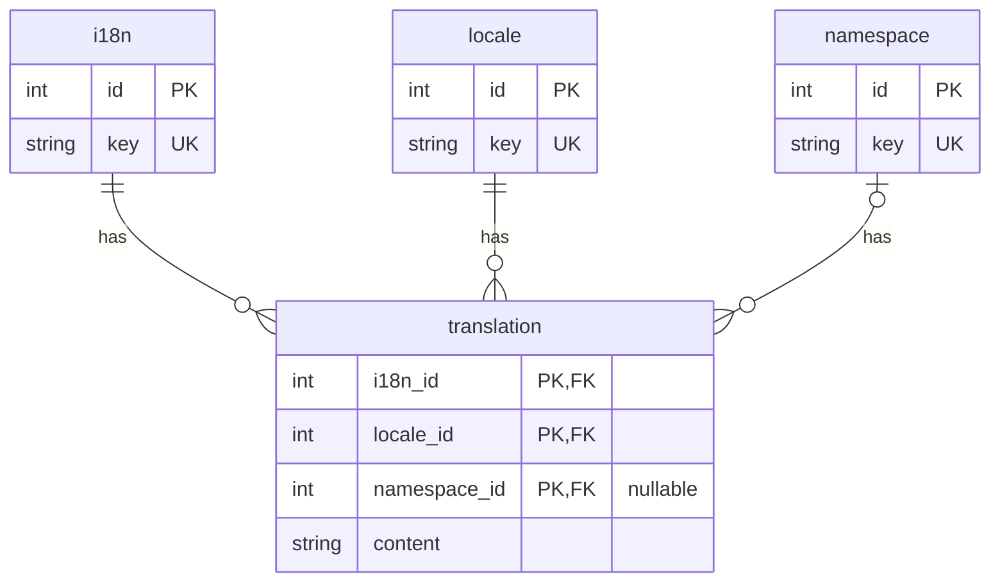

# Lumen + Vue + i18next



## Using devcontainer
```bash
composer create-project --prefer-dist laravel/lumen backend # Create new Lumen project
npm create vite@latest frontend -- --template vue-ts # Create new Vue project
```

